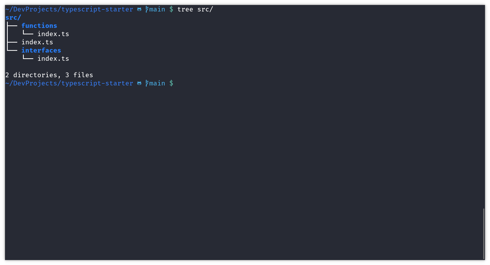

# dotfiles

Here you'll find some of my dotfiles which I use for setup my main tools or
applications like _vim_ or _oh-my-zsh_. You just need to copy the content of
my dotfiles and put it into your files. Maybe some of my confs would required
extra steps to enable all features into them, but I trust that if you're here
you have the enough knowdledge about how to do it.

## .vimrc

## .zshrc

## .bashrc

